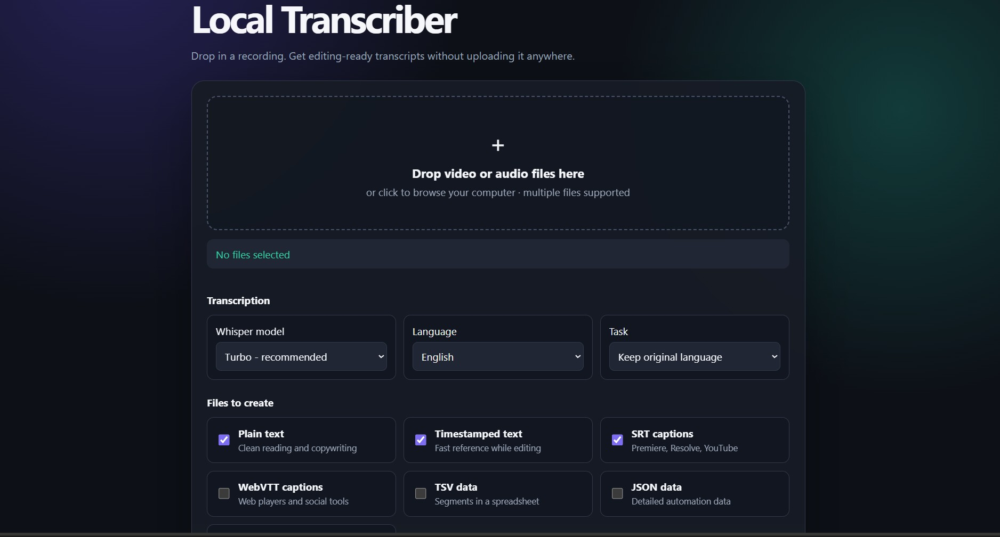
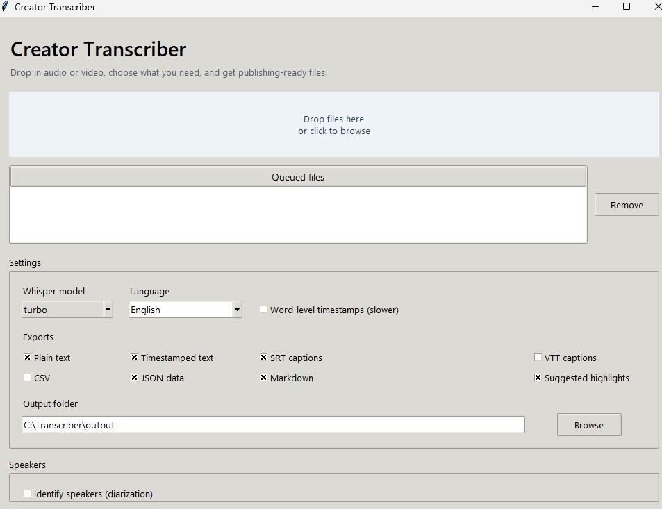
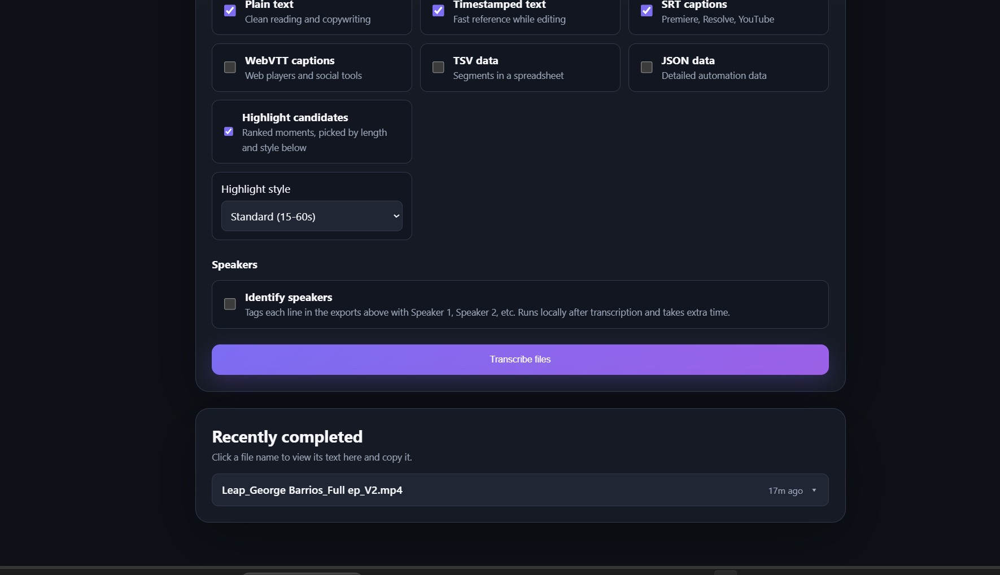

# LocalScribe

A local-first transcription studio for video and audio. Drop in a recording,
get clean transcripts and captions back, find out who's talking, and get a
ranked shortlist of clip-worthy moments — all without uploading your media
anywhere.



## Highlights

- **Drag-and-drop, multi-file queue** — drop in several recordings at once and
  they're processed one after another.
- **Multiple export formats** — plain text, timestamped text, SRT/VTT
  captions, TSV, and raw Whisper JSON.
- **Speaker identification** — optional second pass that tags each line with
  `Speaker 1`, `Speaker 2`, etc., with the ability to rename speakers after
  the fact (the renaming applies everywhere, including the copy/paste view).
- **Highlight candidates** — an automatically ranked shortlist of "clip-worthy"
  moments, with a style preset for longer-form vs. short-form content.
- **Recently completed history** — your last several jobs stay listed with a
  dropdown to view any exported format, cached so you can revisit it later
  and copy the text straight out.
- **Runs entirely on your machine** — built on OpenAI Whisper, with optional
  `pyannote.audio` for speaker labels. Nothing leaves your computer.

## Getting started

### Web app

```
python app.py
```

This starts a local server and opens the app in your browser. Drop video or
audio files onto the page, choose the formats you want, and click
**Transcribe files**.

### Desktop app

Double-click `transcribe.bat`, or run:

```
python transcriber_app.py
```

Click the drop area to choose one or more audio/video files, or drag them
directly onto the app window.



## Outputs

Pick any combination of:

- **Plain text** — clean reading and copy/paste into other tools
- **Timestamped text** — quick reference while editing
- **SRT captions** — Premiere, Resolve, YouTube
- **WebVTT captions** — web players and social tools
- **TSV data** — segment-level data in a spreadsheet
- **JSON data** — the raw Whisper output, useful for automation
- **Highlight candidates** — a ranked shortlist of moments worth clipping



### Highlight presets

Highlight candidates are picked using a scoring pass over the transcript
(question marks, exclamations, numbers, keyword "hooks", and ideal clip
length all factor in). Two presets are available:

- **Standard (15-60s)** — for longer-form clips and trailers.
- **Shorts / Reels / TikTok (15-45s)** — favors tighter windows in the 15-35s
  sweet spot for short-form platforms.

The highlight report is a heuristic shortlist meant to speed up review, not
an editorial decision-maker — always review clips against the source before
publishing.

## Speaker identification

Whisper transcribes speech but doesn't identify *who* is speaking.
LocalScribe can optionally run a second pass with `pyannote.audio` to tag
each line with `Speaker 1`, `Speaker 2`, etc. across every export format.
This runs locally after transcription and takes extra time, especially on
longer files.

Once speakers are identified, you can rename them (e.g. "Speaker 1" →
"Alex") right from the "Recently completed" view — the new names are applied
across the transcript and stick when you switch between export formats.

### One-time setup

Speaker identification uses gated models on Hugging Face, so it needs a free
access token:

1. Accept the terms for both:
   - https://huggingface.co/pyannote/segmentation-3.0
   - https://huggingface.co/pyannote/speaker-diarization-3.1
2. Create a **read** token at https://huggingface.co/settings/tokens
3. Enter that token in the app:
   - **Web UI**: check "Identify speakers" in the Speakers section and paste
     the token into the "Hugging Face token" field. It's saved locally to
     `config.json` (not checked into version control) so you only need to
     enter it once.
   - **Desktop app**: check "Identify speakers (diarization)" and paste the
     token into the Hugging Face token field.
   - Alternatively, set the `HF_TOKEN` (or `HUGGINGFACE_TOKEN`) environment
     variable instead of using the UI field.

Once a token is configured, just check "Identify speakers" before
transcribing. You can optionally set minimum/maximum speaker counts if you
know how many people are in the recording.

> Keep your Hugging Face token private — don't commit `config.json` or share
> it. It's only used to download the speaker-identification models the first
> time you run them.

## Requirements

- Python 3.10+
- `pip install -r requirements.txt`
- A GPU is optional but speeds up both transcription and speaker
  identification significantly.

## License

Copyright © 2026 limmieo. All rights reserved.

This project is shared publicly as a portfolio piece. You're welcome to read
and learn from the code, but it is not licensed for reuse, redistribution, or
commercial use without permission.
